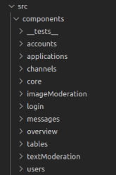
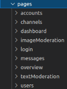
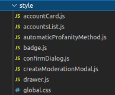

## DIRECTORY STRUCTURE

- Source Folder (/src/... ):

  - All the resources generated by the team for our application reside within this directory.
  - This is the core application source code.
  - “/src/app.js” file is the container of the app and serves as an entry point

- Components folder (/src/components/... ):

  - The components folder contains a collection of UI components like loginForm, channelList,
    applicationList etc that are shared and used across files in the project.

  

- Pages folder (/src/pages/... ):

  - The pages folder reflects the routes of the application. Each component inside this folder has
    its own route.
  - All the various features/screens/pages are defined here. In this case, “dashboard”, “login” and
    “channels” etc. are different pages of our app.
  - Each screen consists of an “index.js” file which exports the screen’s container as a default
    module which makes the screen available as a functional component.

  

- Routes folder (src/routes/...):

  - As the name suggests, all the routing logic resides here.
  - Our app uses “react-router-dom” for routing implementation.
  - Mainly 2 types of routes are included, public & private, where private being the ones that
    require authentication.
  - Routes.js will have all the routes of the application defined within at one place.
  - PrivateRoute.js” is a component to add a check for user authentication for secure/private
    routes.

  

- Services folder (src/services/...):

  - Services are to manage all api requests. You can see them as a bridge or an adapter between the
    database server APIs and the view layer (pages and components) of our application.

  

- Utils folder (src/utils/...)

  - The utils folder is just a place to locate some utility functions that are used repeatedly in
    the project. Files in the utils folder only contain some functions like date formatting, string
    conversion. API client configuration.

- Styles Folder (src/styles/...)

  - Individual components will have a scoped css file and all the css is defined under the Style
    folder.

  
