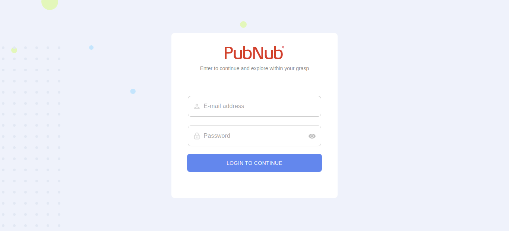
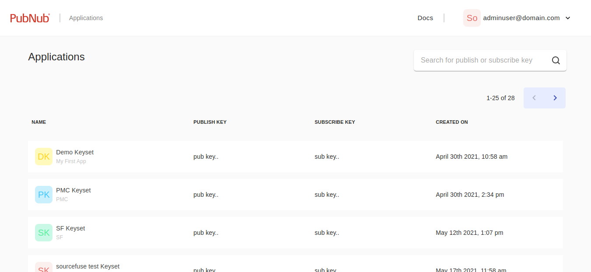
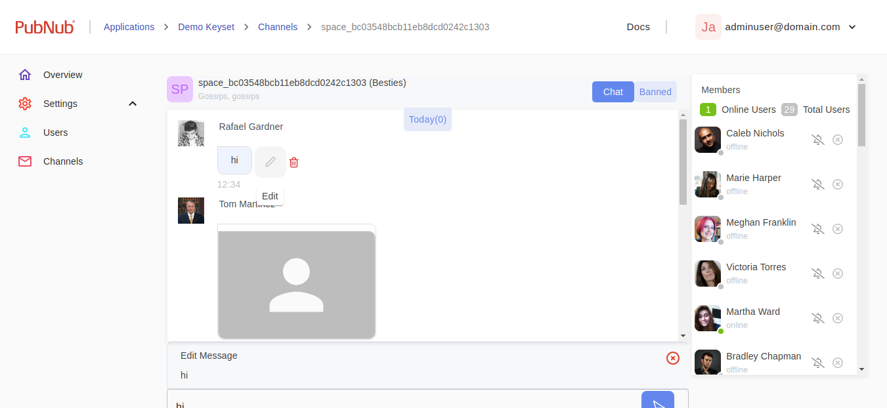
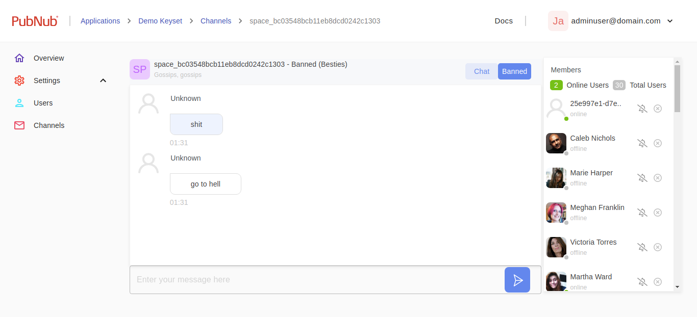

## Login

An admin can login into the moderation tool by using his/her PubNub account.
Note: The tool will not work for PubNub accounts configured with SSO Single Sign On. SSO users with Single Sign-On must add a non SSO user to their account to work with this tool.



Developers with accounts secured via SSO, or developers who wish to "lock down" the dashboard to a specific application, may wish to modify this application with their own login page, and pre-configure their dashboard instance with a specific set of pubnub keys.

Following are required to redirect to applications page of the moderation tool:

- Pubnub userid/password
- API token
- user.id returned from login response(for fetching accounts)
- owner_id from https://admin.pubnub.com/api/accounts?user_id=${user.id} response
- https://admin.pubnub.com/api/apps?owner_id=${owner_id} - For applications listing

## Applications

- An admin can view the keysets related to all applications of a PubNub account in a paginated list.

- An admin can select a keyset by clicking on it which will navigate to the overview page of the keyset.

- An admin can also switch to other accounts which are linked with his/her account.

- The Moderation Dashboard App can be used to provide moderation to multiple PubNub applications.

  

- After selecting a keyset, the user can configure then perform moderation tasks for the application associated with those keys.

## Automatic Moderation

The Dashboard allows Administrators to configure automatic moderation of messages, meaning that messages that contain profanity or inappropriate images can be obfuscated or blocked automatically before they are seen by other chat users.

This functionality is accomplished by [PubNub Functions](https://www.pubnub.com/docs/functions/overview) which can perform realtime transformation on published messages before they are distributed to subscribers. The Moderation Dashboard provides a GUI to configure automatic moderation and will automatically create the PubNub functions based on the configuration. Interested developers can inspect the generated code in the Functions page of the PubNub Admin page for their keyset.

The Moderation Dashboard supports three types of automatic moderation

1. Text Moderation

- Admin can either apply channel ID or channel pattern in which they want to apply text moderation based on the provided word list.

- Admin can select upto 5 languages for profanity filter.

- Admin can provide their choice of words which they want to filter out when moderation is applied or they can also use the default word list.

- Admin can either mask the words or block the message if it contains any words provided by the admin to moderate.

- Admin can optionally select to have moderated message sent to a “banned._” channel. For example if a message sent to the channel “public.watercooler” is moderated, the original message would be sent to banned.public.watercooler. When this option is enabled, developers may wish to use a channel naming convention such as public._ or moderated.\* for all the channels that moderation should be applied to.

  

2. Advanced Text Moderation

- As an alternative to word list based text moderation, developers may wish to leverage third party services that provide more advanced text moderation that can determine things such as abuse, bullying, sexism, etc as well as profanity. These services typically require an account with the third party moderation vendor, and while many vendors provide a free tier, they will typically require payment when run at scale.

- Admin can apply advanced moderation on channel ID or channel pattern.

- The app currently supports two third party moderation vendors Tisana.ai and SiftNinja by Two Hat. Note that SiftNinja is no longer accepting new developers, so if you are starting from scratch we recommend using Tisane.ai.

- AAfter selecting a text moderation vendor, the Admin needs to provide the appropriate third party credentials. See [Working with Third Party Moderation Providers](working-with-third-parties.md) for details on how to obtain the correct credentials.

- The admin must set the threshold range for the various types of moderation that the third party performs. Different moderation vendors use different categories and different thresholds. For example, when the default text moderation vendor, Tisane.ai is selected, the Admin can set threshold for Bigotry (Hate Speech), Personal Attacks (Cyberbullying), Criminal Activity, Sexual Advances, and Profanity.

- Admin can either block a complete message or mask a complete message.

- Admin have a choice if they want to re-route the masked/blocked message to a different channel (respective banned channel) or not. If they select the checkbox for re-routing the masked/blocked message will reroute to the respective banned channel.

  

3. Image Moderation

- Admin can apply advanced image moderation on channel ID or channel pattern. If text moderation is also active, the same channel pattern is used, and it cannot be modified from the Image Moderation configuration page.

- Admin can select a tool they want to use for moderation such as SightEngine.

- Admin need to provide their tool credentials which is selected.
  After selecting an image moderation vendor, the Admin needs to provide the appropriate third party credentials. See [Working with Third Party Moderation Providers](./working-with-third-parties.md) for details on how to obtain the correct credentials.

- Admin can provide a threshold range for risk factor. If any image passes the minimum threshold it will either be masked or blocked based on the admin action.

- Admin can block a complete image if it passes the minimum threshold.

- Admin have a choice if they want to re-route the blocked image to a different channel (respective banned channel) or not. If they select the checkbox for re-routing the blocked image will reroute to the respective banned channel.

  

## Users

The Moderation Dashboard provides a Users view which allows an Admin to browse through the chat applications users and perform various tasks on them. The Users functionality requires that the moderated chat application uses PubNub's User Metadata capability as described in [How To Design A Moderated Chat Application](how-to-design-modertable-app.md)

- An admin can view users metadata in a paginated list by navigating to users page from side bar.

  

- An admin can add a new user from the users page by clcking on the Add User button.

  

- An admin can also update a users metadata by clicking on edit icon in users listing.

- An admin can delete a users metadata with the delete icon in users listing.

- An admin can see flagged and banned users by applying filter over the users.

For details on how the chat application should process these user states see [How To Design A Moderated Chat Application](how-to-design-modertable-app.md)

Note that Objects should be enabled and a region should be selected on the key

1. Flag User

   An admin can flag a user in moderation tool, the metadata for the user will be set in custom property of that user with the following fields

   ```bash
   custom: {flag:true, flaggedBy:'user@domain.com', flaggedAt: '2021-06-17T08:31:55.071Z', reason:'flagged because..'}
   ```

   An admin can view the reason, flagged by and flagged at in the tootlip of the flageed sign.

   

1. Ban User

   An admin can ban a user in moderation tool, the metadata for the user will be set in custom property of that user with the following field

   ```bash
   custom: {ban:true}
   ```

1. Mute User

   An admin can mute a user for a particular channel in moderation tool, the metadata for the user will be set in custom property of that user with the following field

   ```bash
   custom: {mutedChannels: "channel_1, channel_2"}
   ```

   

1. Block User

   An admin can block a user for a particular channel in moderation tool, the metadata for the user will be set in custom property of that user with the following field

   ```bash
   custom: {blockedChannels: "channel_1, channel_2"}
   ```

   

## Channels

The Moderation Dashboard provides a Channels view which allows an Admin to browse the recent message history on a given channel. Admins can perform after the fact moderation by modifying or deleting messages, browse through messages that have been moderated by the automated moderation functions, and perform channel specific actions such as Block and Mute on Users.

- An admin can view channels metadata in a paginated list by navigating to channels page from side bar.

  

- An admin can add a new channel from the channels page by clcking on the Add Channel button.

  

- An admin can delete a channels metadata with the delete icon in channels listing.

- An admin can update a channels metadata with the edit icon in channels listing.

- An admin can join a channel by clicking on a channel or by joining a channel through join channel popup
  by adding channel ID of that channel.

  

Note that Objects should be enabled and a region should be selected on the key

## Channel view

- An admin can view recent messages and view channel members in a channel.

  

- Admins can change or delete messages in the channel view

  

  

- Admins can view messages that have been sent to the blocked channel by the automated moderation, if it has been configured

  

- Admins can Ban or Mute a user from the channel in the channel view

  
